# Linux-text-editor
## This project demonstrates how to use text editors in linux

### For Linux users, text editors are essential tools that play a crucial role in various tasks, from coding and writing to system administration and configuration management. Linux offers a wide range of text editors, catering to different preferences and use cases. In this article, we will delve into the world of Linux text editors, exploring their features, strengths, and popular choices among the community.

### Mostly Used Text Editors in Linux

* Vi or Vim text editor(VIM means Vi Improved).
* Nano text editor.
## basic vim commands
### How to Delete Multiple Lines in Vim Editor

* Go to normal mode by hitting Esc
* To delete a single line, type "dd"
* To delete multiple lines, type "nd" where n is the number of lines (e.g. 5d deletes 5 lines)
* To delete a range of lines, type "x,yd" where x is start line and y is end line (e.g. 5,8d)
## Editing Mode | Insert Mode in Vim Editor

* From normal mode, enter insert mode by typing "i" to insert before the cursor
* Or type "a" to insert after the cursor position
* Or type "o" to start a new line below in insert mode
* Hit Esc to go back to normal mode when done inserting
## How to Save a File in Vim Editor & Quit

* To save, go to normal mode and type ":w" then hit Enter
* To quit, type ":q" and hit Enter
* To save and quit, type ":wq"
* To force quit without saving, type ":q!"

## Nano Editor
### Nano is a user-friendly and lightweight command-line text editor widely used on Unix-based systems, known for its simple interface with on-screen keyboard shortcuts, syntax highlighting support for programming languages, and basic editing features like search/replace, undo/redo, and multiple file buffers, making it an accessible choice for beginners and experienced users alike.

## How to Select all in Nano Text Editor

* Open file in nano
* Hit Ctrl+X to access main menu
* Hit S to enter Select mode
* Hit A to select all text
* Entire file content will be highlighted
* Perform desired operation (cut, copy, etc.)
* Hit Ctrl+6 to deselect
## How to Undo in Nano Editor

* Press Alt+U to undo last operation
* Nano has limited undo capability
## How to Move End of the Line in Nano

* Hit Ctrl+E to jump cursor to end of current line
## How to Save and Exit in Nano Editor in Linux

* Hit Ctrl+X to exit
* Hit Y to save modified buffer
* Hit N to exit without saving

## Hands on vim

* To open a new file named exercise.txt. Run `vim exercise.txt`

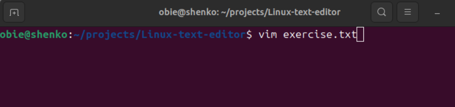

* Hit 'i' to enter insert mode in vim

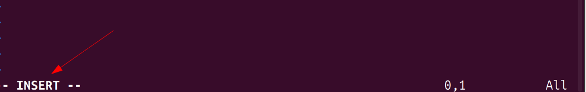

* Enter desired text while on insert mode.

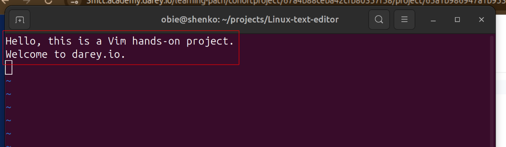

* Move around text line with either left, down, up and right arrows or 'h', 'j', 'k' and 'l' keys on your keyboard

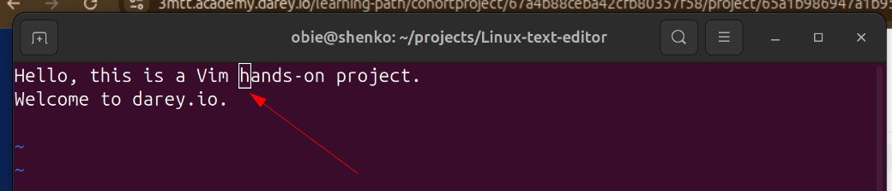

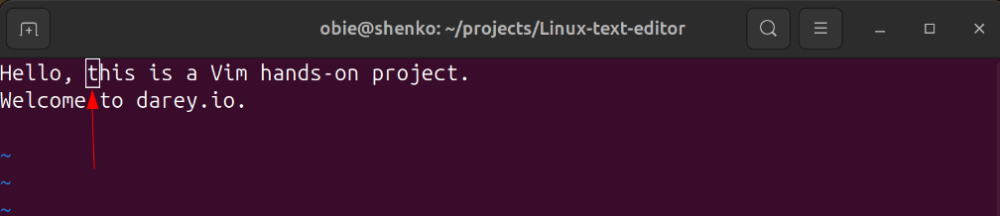

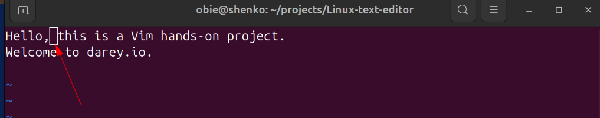

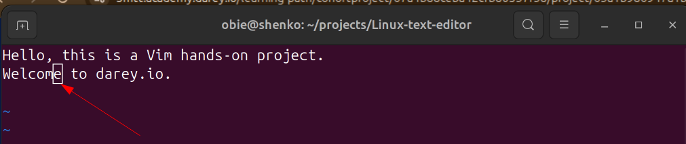

* To delete a character, hit 'esc' key to exit insert mode, then moce cursor the character you want to delete and hit 'del' key.

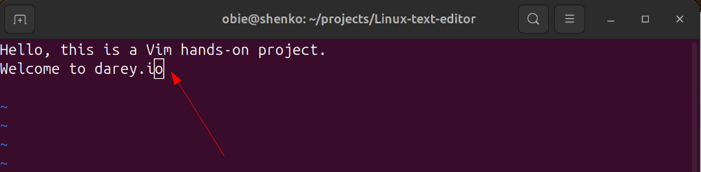

* To delete an entire line, hit 'esc' to exit insert mode if not already. then move the cursor to the line you want to delete and hit 'd' twice.

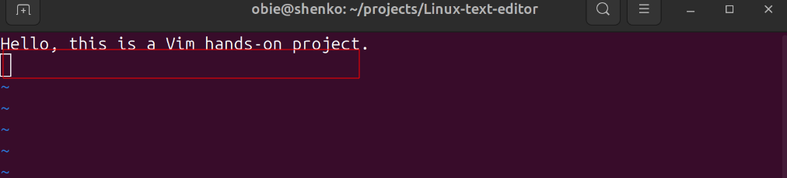

* To undo changes. Use 'esc' to exit insert mode then hit 'u; to undo the last changes.

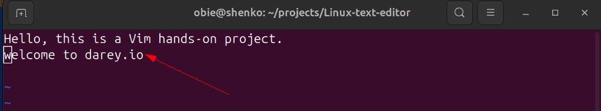

* To save changes, exit insert mode by hitting 'esc' key they hit ':wq' + 'enter'. 'wq' in this context means 'write quit'

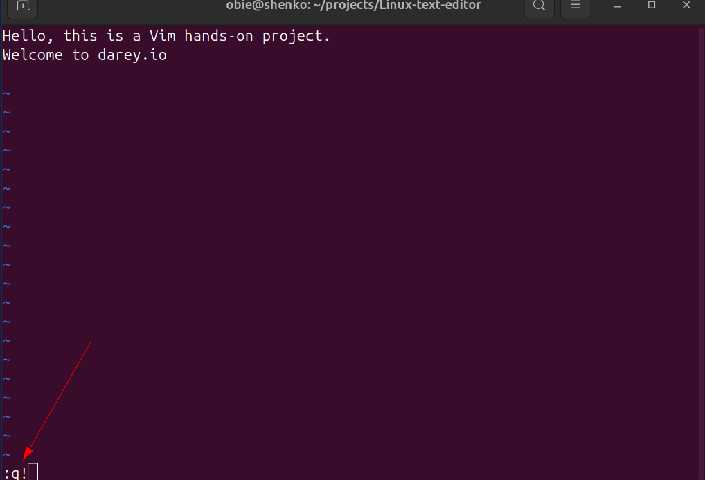

* To exit without saving changes. Hit esc to leave the insert mode, then type ':q!' + 'enter' to quit without saving chnages.

## Nano Editor hands on

* To open a file named nano_file.txt. Run `nano nano_file.txt

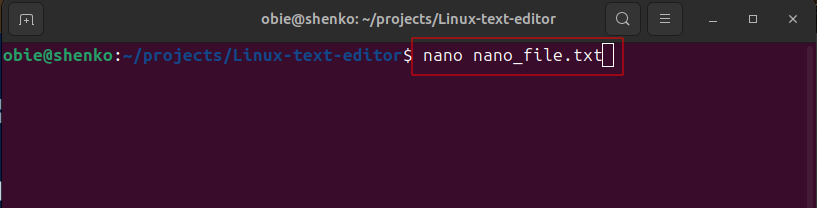

